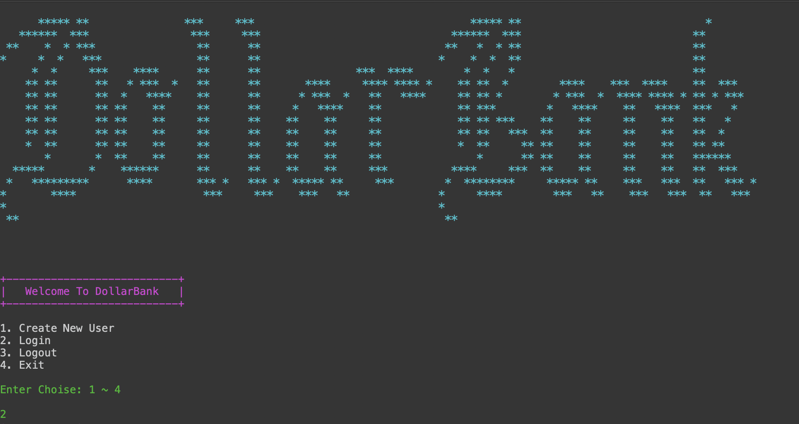
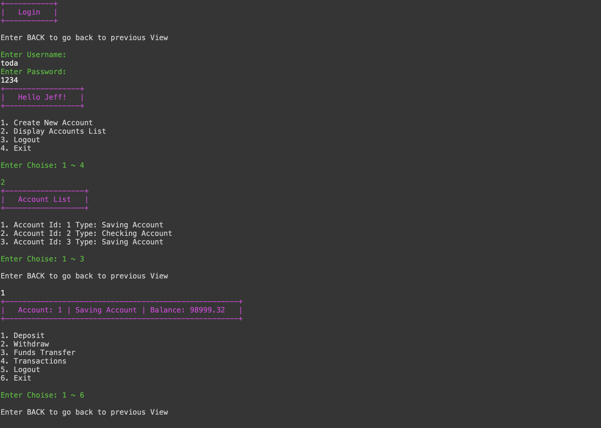
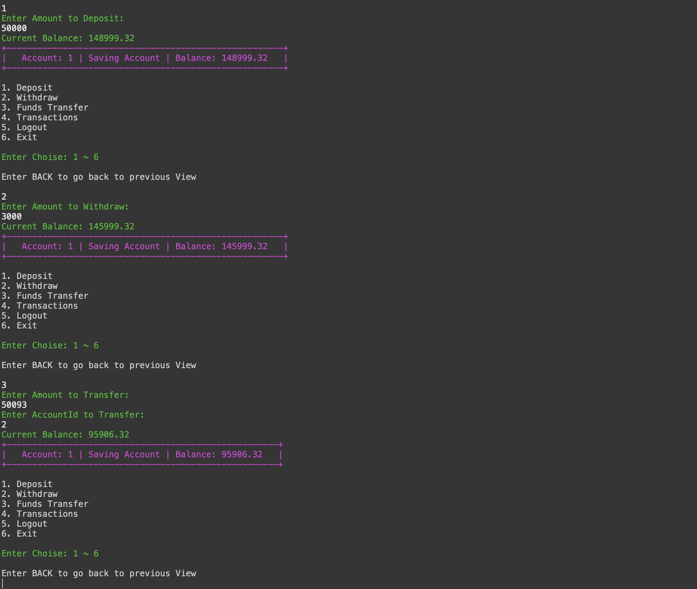
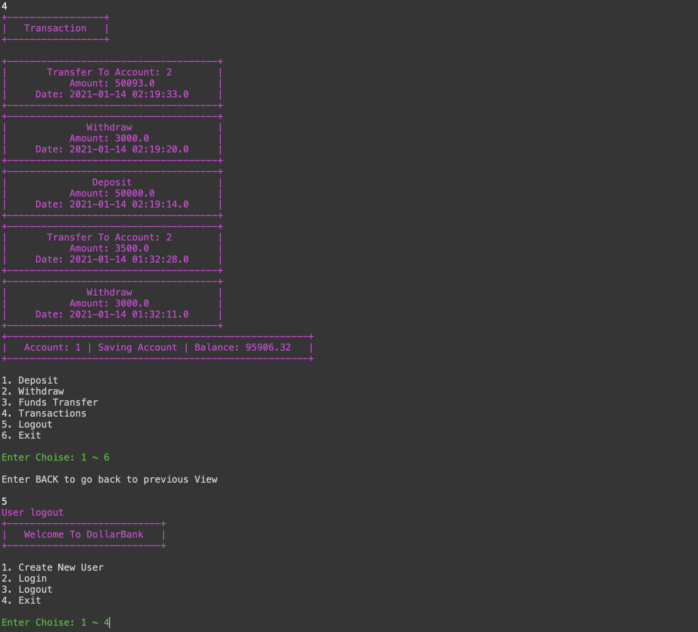

# DollarsBankCoreJavaApp

{:height="50%" width="50%"}




* [Objective](#objective)
* [How to use](#how-to-use)
* [Bonus](#bonus)

## Objective
Objectives ■
- Use layered architecture (abstracted files under SOLID principles) to make an MVC banking application.
- Create a user login system (no DB necessary, use in program memory).
- Once logged in, have a user menu display in console.
- Allow user to make:
  * a. Deposit
  * b. Withdrawl
  * c. Funds Transfer
  * d. 5 recent transaction history
  * e. Display customer information
  * f. Sign out
- Apply business logic to handle illegal operations in:
  * a. login system
  * b. Transactions (withdrawls /depsosits, etc.)
- See sample screenshots (next page).
- After 1 week attempt - sample code will be released

## How to use

```
cd ~
git clone https://github.com/JCTGY/DollarsBankCoreJavaApp.git
import project to Eclipse
run the program
```

## Bonus
- Use JDBC and DAO to connect user info to a database
- Mutiple accounts in one user 
